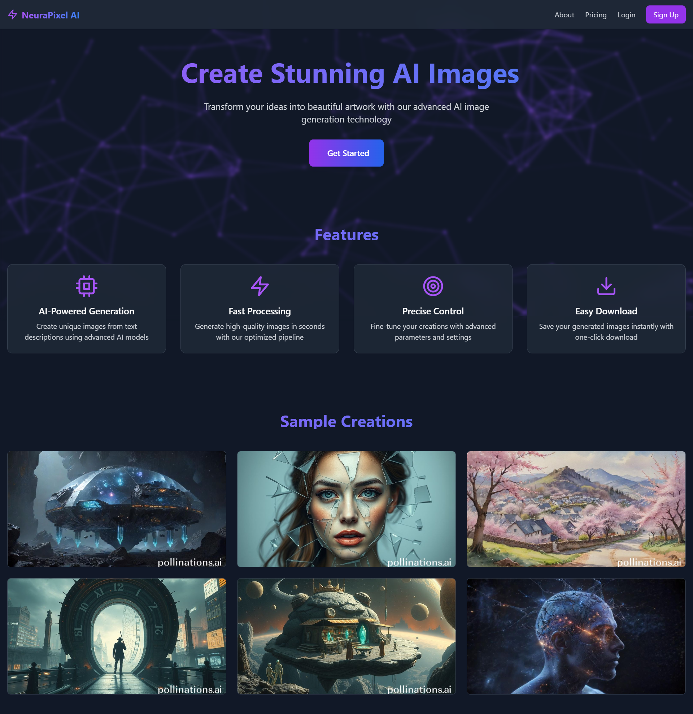
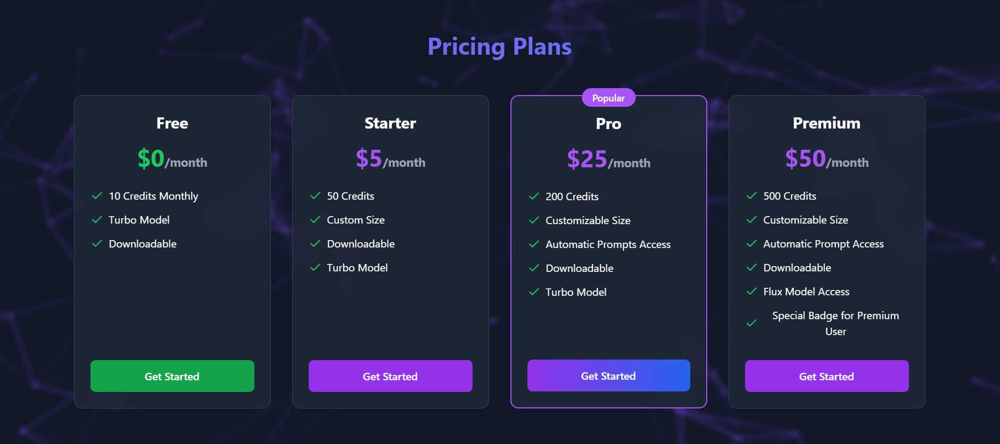
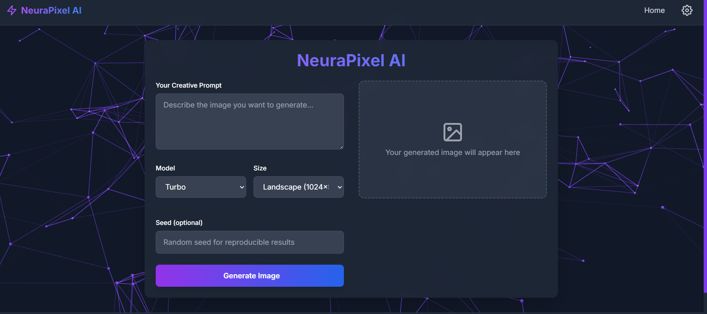
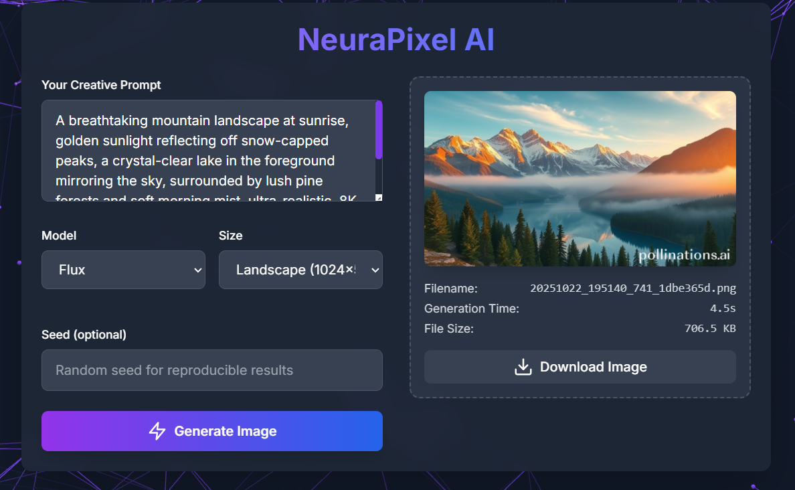

# 🌌 NeuraPixel AI

A **modern AI-powered image generation web application** built with Flask and advanced AI models.

---

## 🚀 Features

- **🧠 AI Image Generation** – Create stunning images from text descriptions  
- **⚡ Multiple Models** – Support for Flux and Turbo AI models  
- **📏 Flexible Sizing** – Custom dimensions and preset sizes  
- **💳 Plan-based Access** – Free, Starter, Pro, and Premium tiers  
- **🎨 Modern UI** – Dark/Light themes with smooth animations  
- **📱 Responsive Design** – Works on both desktop and mobile devices  

---

## 🧩 Installation

1. **Clone the repository:**
   ```bash
   git clone https://github.com/yourusername/neurapixel-ai.git
   cd neurapixel-ai
   ```

2. **Install dependencies:**
   ```bash
   pip install -r requirements.txt
   ```

3. **Run the application:**
   ```bash
   python app.py
   ```

4. **Open your browser and navigate to:**
   👉 http://localhost:5000

## 💡 Usage
1. Visit the landing page to explore features and pricing

2. Click “Get Started” on any pricing plan

3. Enter your creative prompt in the generator

4. Select model and size options based on your plan

5. Generate and download your AI-created images

---

## 🌆 Website Glimpses
A quick look at the NeuraPixel AI web experience 👇

### 🏠 Landing Page


### 💰 Pricing Plans


### 🎨 Image Generator


### 🖼️ Sample Generated Image


💡 All screenshots are from the live NeuraPixel AI interface.

## 🏗️ Project Structure

```
neurapixel-ai/
├── app.py                 # Main Flask application
├── requirements.txt       # Python dependencies
├── templates/             # HTML templates
├── static/                # CSS, JS, and assets
├── services/              # Backend services
├── generated_images/      # Generated image storage
└── sample_images/         # Screenshots for README
```
## 🤝 Contributing
We welcome contributions!

1. Fork the repository

2. Create a feature branch

3. Make your changes

4. Submit a pull request

## 🪪 License
This project is licensed under the MIT License – feel free to use, modify, and share.
