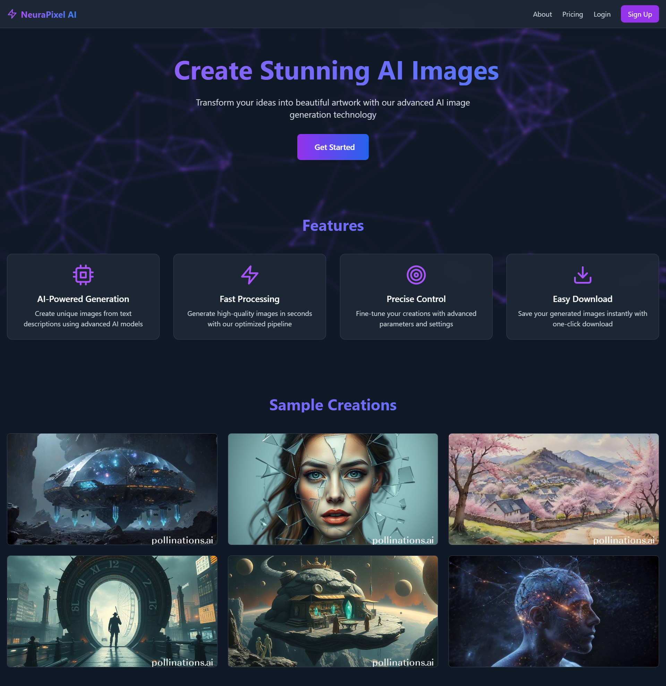
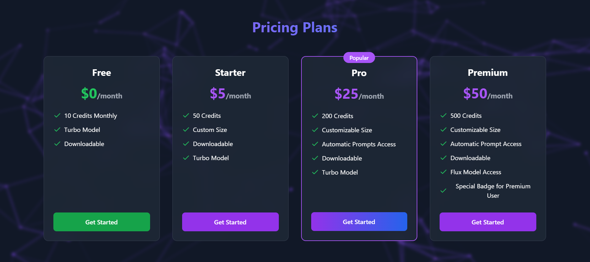
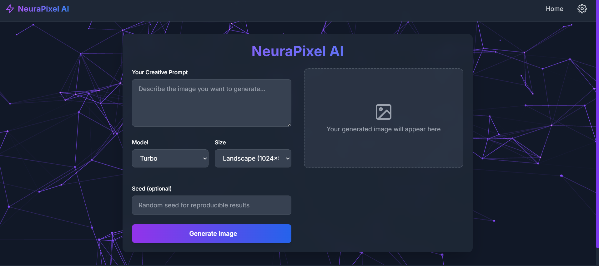
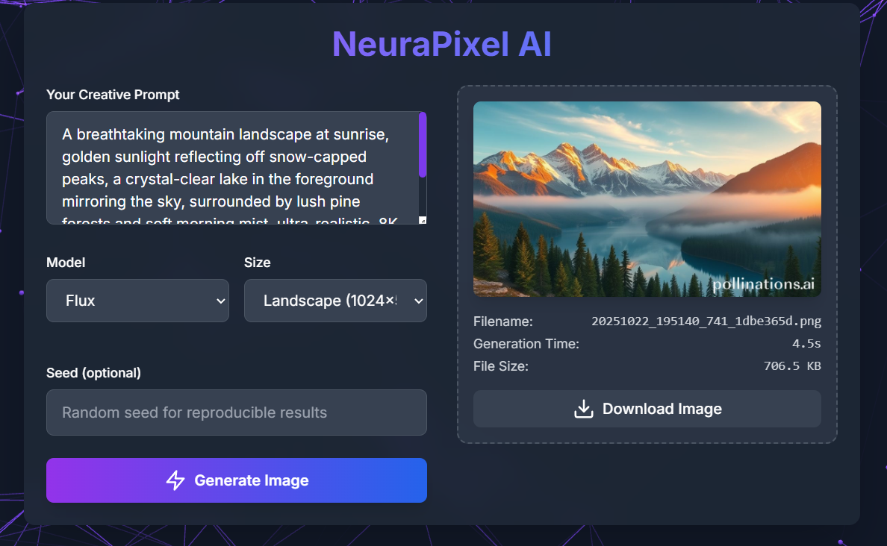

<!-- Animated Header -->
<p align="center">

</p>

<p align="center">

</p>

<p align="center">


</p>

<p align="center">
<a href="#-features">Features</a> •
<a href="#-installation">Installation</a> •
<a href="#-usage">Usage</a> •
<a href="#-website-glimpses">Screenshots</a> •
<a href="#️-project-structure">Project Structure</a>
</p>

---

## 🌌 Overview

**NeuraPixel AI** is a modern AI-powered image generation web application built with Flask and advanced AI models. Type a prompt, pick a model and size, and generate stunning AI-created images — all through a clean, responsive interface with plan-based access tiers.

---

## 🚀 Features

<table>
<tr>
<td width="50%" valign="top">

- 🧠 **AI Image Generation** — create stunning images from text descriptions
- ⚡ **Multiple Models** — support for Flux and Turbo AI models
- 📏 **Flexible Sizing** — custom dimensions and preset sizes

</td>
<td width="50%" valign="top">

- 💳 **Plan-based Access** — Free, Starter, Pro, and Premium tiers
- 🎨 **Modern UI** — dark/light themes with smooth animations
- 📱 **Responsive Design** — works on both desktop and mobile

</td>
</tr>
</table>

---

## 🧩 Installation

<table>
<tr><td width="6%" align="center"><b>1</b></td><td>

**Clone the repository**
```bash
git clone https://github.com/Whopie29/NeuraPixel.git
cd NeuraPixel
```

</td></tr>
<tr><td align="center"><b>2</b></td><td>

**Install dependencies**
```bash
pip install -r requirements.txt
```

</td></tr>
<tr><td align="center"><b>3</b></td><td>

**Run the application**
```bash
python app.py
```

</td></tr>
<tr><td align="center"><b>4</b></td><td>

**Open your browser**
👉 http://localhost:5000

</td></tr>
</table>

---

## 💡 Usage

<table>
<tr><td width="6%" align="center"><b>1</b></td><td>Visit the landing page to explore features and pricing</td></tr>
<tr><td align="center"><b>2</b></td><td>Click <b>"Get Started"</b> on any pricing plan</td></tr>
<tr><td align="center"><b>3</b></td><td>Enter your creative prompt in the generator</td></tr>
<tr><td align="center"><b>4</b></td><td>Select model and size options based on your plan</td></tr>
<tr><td align="center"><b>5</b></td><td>Generate and download your AI-created images</td></tr>
</table>

---

## 🌆 Website Glimpses

A quick look at the NeuraPixel AI web experience 👇

<table>
<tr>
<td align="center" width="50%">

**🏠 Landing Page**


</td>
<td align="center" width="50%">

**💰 Pricing Plans**


</td>
</tr>
<tr>
<td align="center" width="50%">

**🎨 Image Generator**


</td>
<td align="center" width="50%">

**🖼️ Sample Generated Image**


</td>
</tr>
</table>

<p align="center"><i>💡 All screenshots are from the live NeuraPixel AI interface.</i></p>

---

## 🏗️ Project Structure

```
NeuraPixel/
├── app.py                 # Main Flask application
├── requirements.txt       # Python dependencies
├── templates/              # HTML templates
├── static/                 # CSS, JS, and assets
├── services/                # Backend services
├── generated_images/       # Generated image storage
└── sample_images/          # Screenshots for README
```

---

## 🤝 Contributing

We welcome contributions!

1. Fork the repository
2. Create a feature branch
3. Make your changes
4. Submit a pull request

---

## 🪪 License

This project is licensed under the **MIT License** — feel free to use, modify, and share.

---

<p align="center">

</p>
