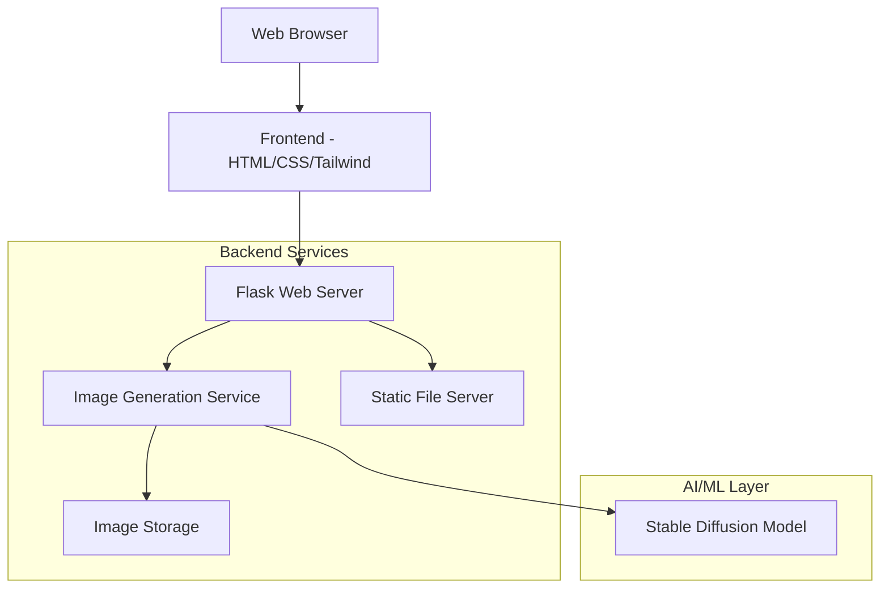

# Design Document

## Overview

The AI-powered image generator will be built as a web application using Python Flask as the backend framework and HTML/CSS with Tailwind CSS for the frontend. The core image generation will leverage Hugging Face's Diffusers library with Stable Diffusion models, providing high-quality text-to-image generation capabilities.

## Architecture

### High-Level Architecture



### Technology Stack

- **Backend**: Python Flask web framework
- **Frontend**: HTML5, CSS3, Tailwind CSS for styling
- **AI/ML**: Hugging Face Transformers and Diffusers libraries
- **Model**: Stable Diffusion (stable-diffusion-v1-5 or similar)
- **Image Processing**: PIL (Python Imaging Library)
- **File Storage**: Local filesystem with organized directory structure

## Components and Interfaces

### 1. Frontend Components

#### Main Interface (`index.html`)
- **Prompt Input Field**: Large text area for user input with character counter
- **Generate Button**: Primary action button with loading states
- **Image Display Area**: Responsive container for generated images
- **Download Button**: Appears after successful generation
- **Loading Indicator**: Spinner/progress indicator during generation
- **Error Display**: Alert component for error messages

#### Styling Framework
- **Tailwind CSS**: Utility-first CSS framework for responsive design
- **Custom Components**: Reusable button, input, and card components
- **Responsive Grid**: Mobile-first responsive layout

### 2. Backend Components

#### Flask Application (`app.py`)
- **Route Handlers**:
  - `GET /` - Serve main application page
  - `POST /generate` - Handle image generation requests
  - `GET /download/<filename>` - Serve generated images for download
  - `GET /static/<path>` - Serve static assets

#### Image Generation Service (`image_generator.py`)
- **StableDiffusionPipeline**: Wrapper around Hugging Face Diffusers
- **Prompt Processing**: Text cleaning and validation
- **Image Post-processing**: Resize, format conversion, optimization
- **Error Handling**: Model loading failures, generation timeouts

#### File Management (`file_manager.py`)
- **Image Storage**: Organized directory structure for generated images
- **Cleanup Service**: Remove old images to manage disk space
- **File Naming**: Timestamp-based naming with prompt hash

### 3. AI/ML Components

#### Model Configuration
- **Primary Model**: `runwayml/stable-diffusion-v1-5`
- **Pipeline Type**: `StableDiffusionPipeline`
- **Device**: CUDA if available, fallback to CPU
- **Precision**: Mixed precision (fp16) for GPU efficiency

#### Generation Parameters
- **Image Size**: 512x512 pixels (standard for Stable Diffusion v1.5)
- **Inference Steps**: 20-50 steps (configurable based on quality/speed trade-off)
- **Guidance Scale**: 7.5 (balance between prompt adherence and creativity)
- **Seed**: Random or user-specified for reproducibility

## Data Models

### Request/Response Models

```python
# Generation Request
{
    "prompt": str,           # User input text (max 500 chars)
    "seed": int,            # Optional random seed
    "steps": int,           # Optional inference steps (20-50)
    "guidance_scale": float # Optional guidance scale (5.0-15.0)
}

# Generation Response
{
    "success": bool,
    "image_url": str,       # URL to generated image
    "filename": str,        # Generated filename
    "prompt": str,          # Original prompt
    "generation_time": float, # Time taken in seconds
    "error": str            # Error message if failed
}
```

### File Structure
```
generated_images/
├── YYYY-MM-DD/
│   ├── {timestamp}_{hash}.png
│   └── {timestamp}_{hash}.png
└── cleanup_log.txt
```

## Error Handling

### Client-Side Error Handling
- **Input Validation**: Real-time prompt length validation
- **Network Errors**: Retry mechanism with exponential backoff
- **Timeout Handling**: 60-second timeout with user notification
- **User Feedback**: Clear error messages with suggested actions

### Server-Side Error Handling
- **Model Loading Errors**: Graceful fallback and error reporting
- **Memory Errors**: Request queuing and resource management
- **Generation Failures**: Detailed logging and user-friendly error messages
- **File System Errors**: Proper error handling for storage operations

### Error Categories
1. **User Input Errors**: Invalid prompts, empty inputs
2. **System Errors**: Model loading, memory issues, disk space
3. **Network Errors**: Connection timeouts, request failures
4. **Generation Errors**: Model inference failures, NSFW content filtering

## Testing Strategy

### Unit Testing
- **Backend Logic**: Test Flask routes, image generation service
- **Utility Functions**: File management, prompt processing
- **Error Handling**: Exception scenarios and edge cases

### Integration Testing
- **End-to-End Workflow**: Complete generation pipeline testing
- **API Testing**: Request/response validation
- **File Operations**: Image storage and retrieval testing

### Performance Testing
- **Load Testing**: Multiple concurrent generation requests
- **Memory Usage**: Monitor GPU/CPU memory during generation
- **Response Times**: Measure generation speed under various conditions

### Manual Testing
- **UI/UX Testing**: Cross-browser compatibility, responsive design
- **Image Quality**: Visual inspection of generated images
- **Download Functionality**: File download across different browsers

## Security Considerations

### Input Sanitization
- **Prompt Filtering**: Remove potentially harmful or inappropriate content
- **Length Limits**: Enforce character limits to prevent abuse
- **Rate Limiting**: Prevent excessive requests from single users

### File Security
- **Secure File Naming**: Prevent directory traversal attacks
- **File Type Validation**: Ensure only image files are served
- **Access Control**: Limit access to generated images

### Resource Management
- **Memory Limits**: Prevent memory exhaustion from large requests
- **Disk Space**: Implement cleanup policies for old images
- **Request Queuing**: Handle concurrent requests efficiently

## Performance Optimization

### Model Optimization
- **Model Caching**: Keep model loaded in memory
- **Mixed Precision**: Use fp16 for faster inference on compatible GPUs
- **Batch Processing**: Handle multiple requests efficiently

### Frontend Optimization
- **Image Compression**: Optimize image sizes for web display
- **Lazy Loading**: Load images progressively
- **Caching**: Browser caching for static assets

### Infrastructure
- **GPU Utilization**: Optimize CUDA memory usage
- **Async Processing**: Non-blocking request handling
- **CDN Integration**: Future consideration for image delivery